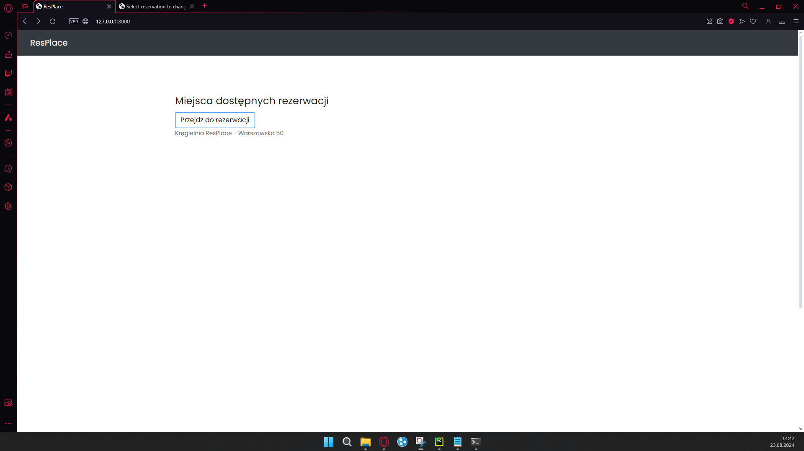
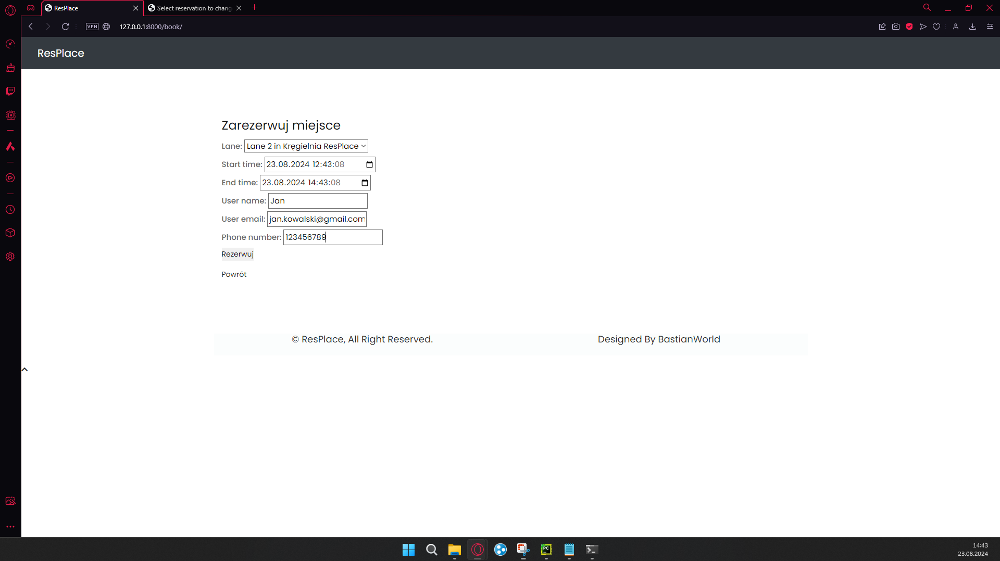
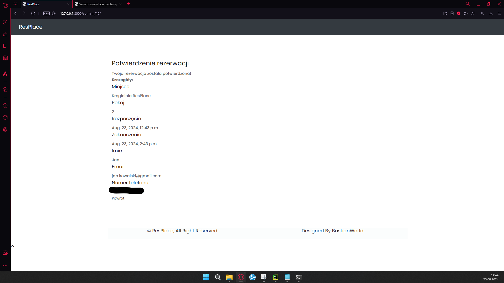
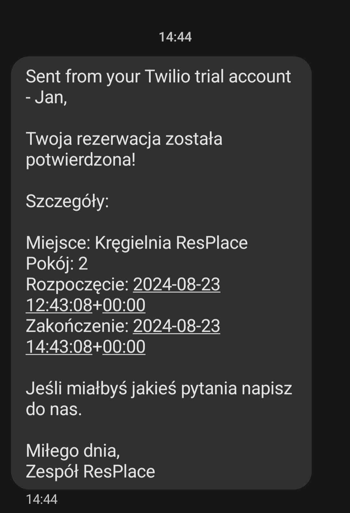
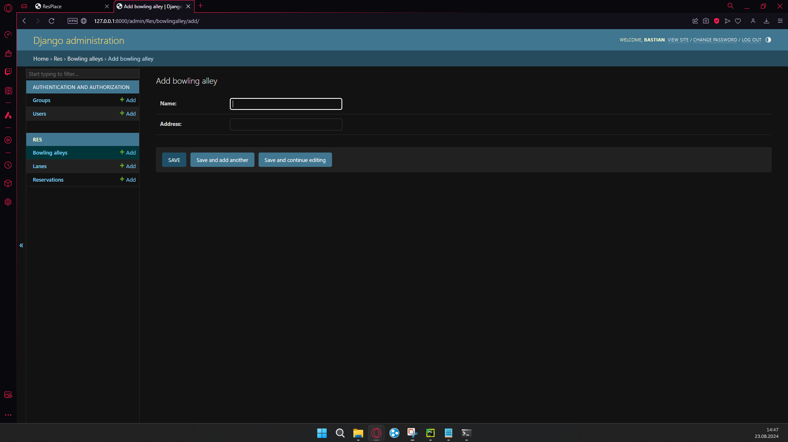
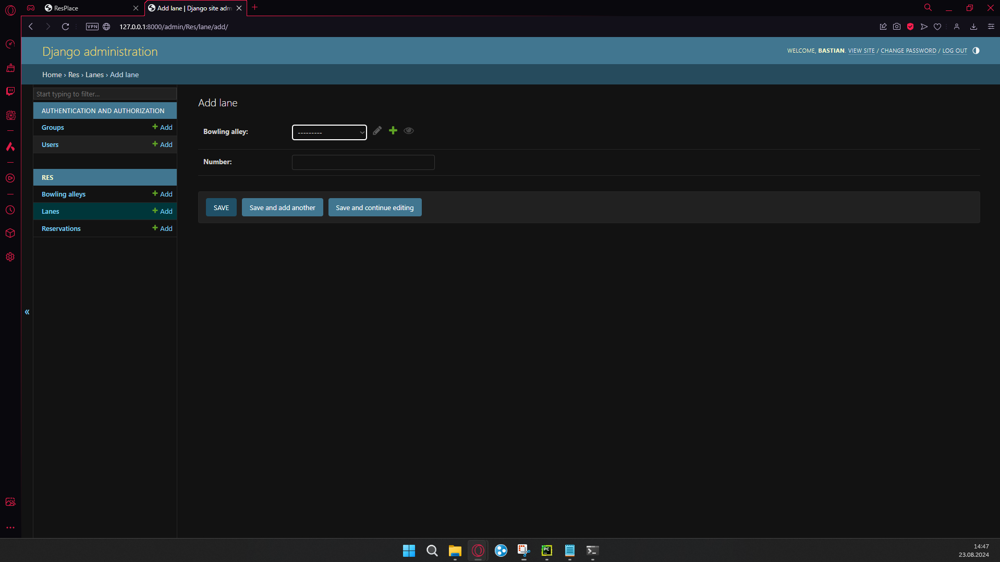
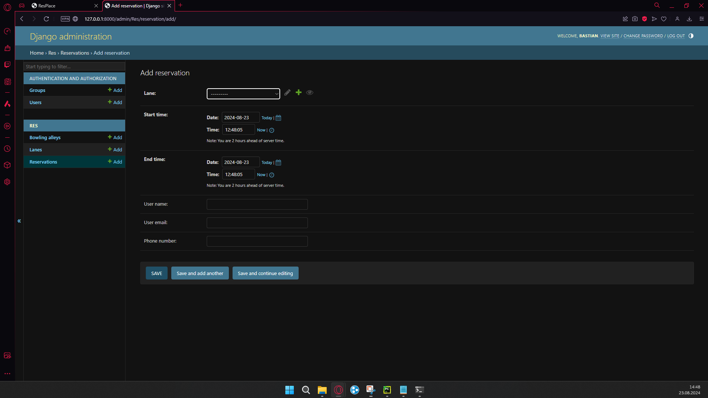

<h1>ResPlace</h1>

ResPlace to aplikacja rezerwacyjna, która pozwala użytkownikom na zarezerwowanie lokalu na dany dzień oraz godzinę. Projekt ten został stworzony w celu ułatwienia zarządzania terminami rezerwacji.

 
<h2>Funkcjonalności</h2>
<ul>
    <li>Rezerwacja lokalu</li>
    <li>Dodawanie sal oraz pokoi</li>
	<li>Wysłanie potwierdzenia rezerwacji SMS</li>
</ul>

<h2>Technologie</h2>
<ul>
    <li>Django 3.x</li>
    <li>Python 3.x</li>
<li>Twilio (do wysyłania SMS)</li>
</ul>

<h2>Instalacja</h2>
<ol>
    <li>Sklonuj repozytorium: <code>git clone https://github.com/Bastian8004/ResPlace.git</code></li>
    <li>Zainstaluj zależności: <code>pip install -r requirements.txt</code></li>
    <li>Uruchom aplikację: <code>python manage.py runserver</code></li>
    <li>Otwórz okno aplikacji i zacznij korzystać!</li>
</ol>

<h2>Dalszy rozwój</h2>

Projekt ResPlace jest w ciągłym rozwoju. Planowane są następujące funkcjonalności:

<ul>
    <li>Dodanie czegoś na wzór kręgielni - rezerwacja torów na daną godzine</li>
    <li>Płatności za lokal/tor do kręgli</li>
</ul>

<h2>Poniżej znajdują się zdjęcia z wiidoku przeglądarki</h2>

<h4>Widok dostępnych rezerwacji</h4>

<h4>Formularz rezerwujący miejsce przez użytkownika</h4>

<h4>Widok potwierdzający rezerwacje</h4>

<h4>SMS potwierdzający rezerwacje</h4>

<h4>Widok z panelu administracyjnego - dodawanie lokalu</h4>

<h4>Widok z panelu administracyjnego - dodawanie pokoju/toru</h4>

<h4>Widok z panelu administracyjnego - rezerwacja</h4>

